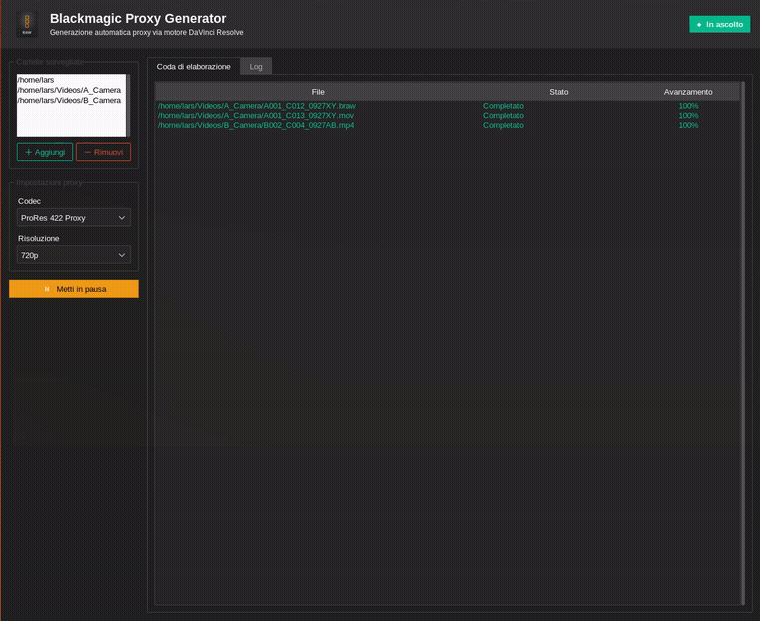

# Blackmagic Proxy Generator (Linux)

An unofficial Linux equivalent of Blackmagic Design's Windows-only "Blackmagic
RAW Proxy Generator". Blackmagic never shipped a Linux build of that tool, so
this recreates the useful part of it: a background watch-folder service that
automatically transcodes camera clips into lightweight editing proxies.




## How it works

Rather than reimplementing camera RAW decoders from scratch, this tool drives
**DaVinci Resolve's own scripting API** in headless (`-nogui`) mode to do the
actual decode/encode work — the same engine Resolve (and, most likely,
Blackmagic's own Windows proxy tool) uses under the hood. That gives it wide
format coverage (BRAW, standard camera codecs, and whatever else your Resolve
install can decode) for free, instead of being limited to what `ffmpeg` alone
can read.

**Important limitation:** DaVinci Resolve only keeps one project open at a
time. If Resolve is already open and you're actively editing, this tool will
**not** silently hijack your open project — it queues incoming files and
waits ("Resolve busy") until you close your project, or until you explicitly
double-click a queued item and confirm "generate anyway" (which *will*
interrupt your Resolve session). If Resolve isn't running, the tool launches
a separate headless instance dedicated to proxy rendering, which runs
alongside a normal Resolve session with no conflict.

## Features

- Watch one or more folders (recursively) for new clips, mirrors the folder
  structure into a `Proxy/` output subfolder (or a custom output per folder)
- Codec presets: H.264 (lightweight), ProRes 422 Proxy, ProRes 422 LT,
  DNxHR LB, DNxHR SQ
- Resolution presets: original, 1080p, 720p, 540p
- Dark, modern GUI (ttkbootstrap) with a live processing queue and log
- Optional system tray icon (via `pystray`) — closes to tray instead of quitting
- Desktop notifications on completion/failure
- Runs at login (optional, via a standard XDG autostart entry)

## Requirements

- Linux with a desktop environment (built/tested on [Omarchy](https://omarchy.org/) / Hyprland, but any XDG-compliant desktop works)
- [DaVinci Resolve](https://www.blackmagicdesign.com/products/davinciresolve) (free or Studio) installed at `/opt/resolve` — this is what actually decodes/encodes media
- `ffmpeg`, `inotify-tools` (`inotifywait`)
- Python 3.9+ with `tkinter` (usually preinstalled or a small distro package, e.g. `python-tk`/`tk`)

## Install

```bash
git clone https://github.com/Limestudio90/blackmagic-proxy-generator-linux.git
cd blackmagic-proxy-generator-linux
./install.sh
```

The installer creates a local virtualenv (no `sudo` required), a launcher in
`~/.local/bin`, and an app menu entry. It will ask whether to start the app
automatically at login.

Run it with:

```bash
blackmagic-proxy-generator
```

or find **"Blackmagic Proxy Generator"** in your application launcher.

## Uninstall

```bash
./uninstall.sh
```

## Configuration

Settings (watch folders, codec, resolution) are edited from the GUI and saved
to `~/.config/blackmagic-proxy-generator/config.json`.

## Known limitations

- Requires DaVinci Resolve to be installed — this is intentional, since it's
  the only free way on Linux to get access to proper RAW decoding (BRAW and
  whatever else your Resolve build supports).
- Because Resolve only has one active project at a time, this tool cannot
  render proxies *through the same running instance* while you're actively
  editing a different project in it — see "How it works" above for the exact
  behavior.
- No AAF/EDL relinking helpers (yet) — this only generates the proxy media
  itself.

## License

MIT — see [LICENSE](LICENSE). Not affiliated with or endorsed by Blackmagic
Design.
